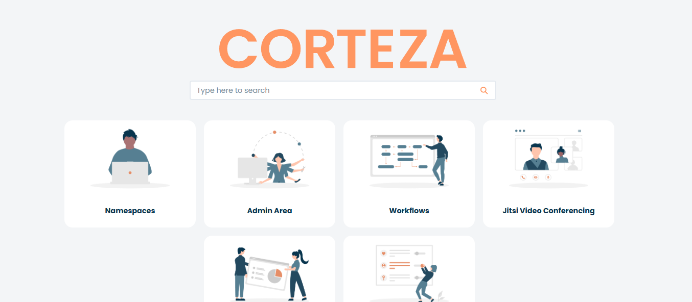

# Installation guide

## Prerequisites

> [!IMPORTANT]
> Run `docker-compose version` and `git --version`, if they are installed you can skip this section.

The server needs `docker-compose` and `git`. They usually come pre-installed on unix, however may need to be installed if ran on a Windows Server.

Official documentation on how to install these prerequisites can be found here:

- `docker-compose` standalone installation: [Docker Docs](https://docs.docker.com/compose/install/standalone/)
- `git` CLI installation: [Git SCM Downloads](https://git-scm.com/downloads)


## Cloning the repository

1. Ensure you are in the proper directory, ideally `~/` for Linux/MacOS/Windows.
2. Clone the repository using `git clone`:
```bash
git clone https://github.com/vittopan/oceans-institute-system.git
```
3. `cd` onto the cloned directory e.g. `cd ~/oceans-institute-system`


## First-time installation

> [!WARNING]
> If given a `.tar` file with an `.env`, `docker-compose.yaml`, and `.sql`, extract the contents to the same directory and refer to **Postgres (Containerised)**.

### Containerised Deployment

> [!WARNING]
> The following steps assumes that the postgres database is ran along with the server and the webserver. If using a Data-as-a-Service (DaaS) instance, see **Postgres (External)**. 

Before running the server, the postgres container must first be initialised. Ensure the docker system service or daemon is running before continuing. **Ensure you are in the correct directory (`cd` to the folder with the `docker-compose.yaml` file)**.

#### 1. Configure `docker-compose.yaml`

Editing any configuration outside what is provided requires knowledge that first must be understood via reading the corteza, postgres, docker, and any relevant applications' documentation. Otherwise, use what have been provided.

Ensure `docker-compose.yaml` is properly configured. Refer (but not copy) to **Multi-Image PostgreSQL** on [Corteza Docs: Online Deployment Examples](https://docs.cortezaproject.org/corteza-docs/2024.9/devops-guide/examples/deploy-online/index.html). 
- If working with containerised `postgres`:
  - Use the `postgres:15` image, set `POSTGRES_USER`, `POSTGRES_PASSWORD`, and `POSTGRES_DATABASE` to `corteza`. If needed, change **ONLY** the `POSTGRES_PASSWORD`.
  - In a production environment, ensure `docker-compose` networks `postgres` on an `internal` network on port `5432` (e.g. `networks: [ internal ]`).
  - Ensure `volumes` is set for persistent storage.
- In the context of the `corteza` service:
  - Ensure `version` is set to `2024.9` (make sure this is reflected on the `.env` file). Image path should be `cortezaproject/corteza:2024.9` if done correctly.
  - If handling networking via docker, ensure the container is on the `proxy/external` and `internal` network. If not, ensure the port `80` is exposed.


#### 2. Configure PostgreSQL Container (with `*.sql` file)

Make sure that `docker-compose.yaml` has the correct `POSTGRES_USER`, `POSTGRES_PASSWORD`, and `POSTGRES_DATABASE` (default: `corteza` for all). Follow the following steps if working with an `*.sql` file.

1. `docker-compose up db`
2. `cat corteza_db.sql | docker exec -i postgresdb psql -X -U corteza`, format: `cat <PATH_TO_SQL_FILE> | docker-compose exec db psql -X -U <POSTGRES_USER>`
    **Troubleshooting**: 
    - If `/restrict` is giving an error, try using: `{ printf '%s\n' '\unrestrict'; cat <PATH_TO_SQL_FILE>; } |   docker-compose exec db psql -X -U <POSTGRES_USER> -v ON_ERR`
    - If permission is denied by the system, make sure to use an escalated-privilege shell through `sudo` or `sudo -s`, or use `docker-compose exec --privileged db ...`

3. `docker-compose restart db`

#### 3. Running the corteza server

After configuring the `postgres` container, double check `.env` and `docker-compose.yaml`.

Pay extra attention to `DB_DSN` on `.env`, make sure the values are the same as the provided credentials set on the `docker-compose.yaml` e.g. `POSTGRES_PASSWORD`).
  - Example: if `POSTGRES_PASSWORD` is changed to `ThisIsNotAGoodPassword123!` on the `docker-compose.yaml` file, the `.env` should have the `DB_DSN` variable set as `postgres://corteza:ThisIsNotAGoodPassword123!@db:5432/corteza?sslmode=disable`.

If values match, or untouched from the given configuration, simply run:

```shell
docker-compose up -d
```

### Postgres (External)

> [!WARNING]
> Connecting to an external Data-as-a-Service (DaaS) instance of postgres is unfortunately experimental and largely undocumented. This feature remains untested, therefore we highly recommend using the containerised solution on a virtual machine. Refer to existing corteza documentation, specifically **DevOps**->**Online Deployment Examples**.
> You can use this section as reference if attaching to the postgres docker container through `docker exec -it postgresdb`.

On your external postgres server, create the user `corteza` and the database `corteza`. Default password is `corteza` however this may be changed if needed.

Before continuing on the next steps, run `psql -U <SUPER_USER>` or equivalent to enter the PostgreSQL shell:

1. Creating the database
```sql
CREATE DATABASE corteza;
```

2. Creating the user
```sql
CREATE USER corteza WITH ENCRYPTED PASSWORD 'PASSWORD_AS_CONFIGURED_IN_DOCKER_COMPOSE_YAML';
```

3. Grant privileges to user `corteza`
```sql
GRANT ALL PRIVILEGES ON DATABASE corteza TO corteza;
```

4. Update `.env`:
Default values as reference:
 `<USERNAME>`: `corteza` or as set.
 `<PASSWORD>`: `corteza` or as set.
 `<URL>`: `db` if local, connection url if external.
 `<DATABASE_NAME>`: `corteza` or as set.
 `sslmode`: `disable` by default, must be tunnelled through an internal secure network. There is no official documentation for `sslmode=enable`.

```shell
DB_DSN = 'postgres://<USERNAME>:<PASSWORD>@<URL>/<DATABASE_NAME>?sslmode=<disable>'
```

5. Update `docker-compose.yaml`:
```yaml
services:
    postgres:
        //DELETE EVERYTHING UNDER AND INCLUDING THE postgres ENTRY
```

6. If given an `.sql` file, ensure the server has a copy (**do not upload to an insecure storage medium such as a Git Repository**), and run:
```shell
cat PATH_TO_SQL_FILE | psql -X -U POSTGRES_USER -d DATABASE_NAME -v ON_ERR
```
## Production Deployment

> [!IMPORTANT]
> Production-facing web apps should use HTTPS (HTTP over SSL) to ensure integrity and privacy of data transfers. This requires a third party **certificate provider** that requires a **domain**. Before continuing, ensure you have a **domain** provided that is reachable, and also the **public IP** of the server.

> [!WARNING]
> If using a hosting service, make sure ports `443, 80, 81` are exposed. The nginx proxy manager uses port `81` for backend configuration. 
For production-facing deployment of corteza, use the `docker-compose-production.yaml` instead. 

`docker-compose-production.yaml` uses the **Nginx Proxy Manager**, a free open-source GUI-based web application for handling SSL certificates via LetsEncrypt.

### First-time Access

#### Nginx Proxy Manager Configuration

After configuration of the postgres image and running `docker-compose -f docker-compose-production.yaml up -d`, access the NPM through `<PUBLIC_IP>:81`. Use `admin@example.com` and `changeme` for username/password respectively. This will need to be changed immediately after log-in for security purposes.

Then, head to **SSL Certificates**->**Add SSL Certificate**->**LetsEncrypt**, enter the domain name provided by a provider e.g. `website-crm.uwa.edu.au`. The nginx proxy manager handles certificates automatically. 


Alternatively if you have the **Certificate Key/File** through a different certificate provider upload them through **SSL Certificates**->**Add SSL Certificate**->**Custom**.


**Then,** head to the **Hosts**->**Proxy Hosts** page, and click on **Add Proxy Host**.

Under domain name, enter the same domain name you have been provided, and enter the following settings:

- Scheme: **HTTP**
- Forward Hostname/IP: `server`
- Forward Port: `80`
- Tick `Cache Assets`, `Block Common Exploits`, `Websockets Support` as `enabled`.
- Leave access list as `publically available`.

After, head to the **SSL** tab, and select the certificate already configured before.

Finally, head to the **Advanced** section, and use these settings (unless directed otherwise):
```bash
proxy_set_header Host $server;
proxy_set_header X-Forwarded-Proto $forward_scheme;
proxy_set_header X-Forwarded-For $proxy_add_x_forwarded_for;
proxy_set_header X-Forwarded-Host $server;
proxy_set_header X-Forwarded-Port 443;
proxy_set_header X-Forwarded-Ssl on;
```

Click **Save** to finalise these settings. To check if the proxy is configured properly, head to the same domain name, and see if it redirects you to the corteza login page. Use given credentials, and if you are able to reach the home page then you have now successfully configured **HTTP over SSL (HTTPS)**, encrypting data between your computer and the CRM website.



For more information, see the official documentation for the nginx proxy manager here:
- [Nginx Proxy Manager Docs](https://nginxproxymanager.com/guide/)


# Other Documentation

It is highly recommended to browse existing documentation provided by Corteza, Postgres, and Docker:

- [Corteza 2024.9 Docs](https://docs.cortezaproject.org/corteza-docs/2024.9/index.html)
- [Postgres 15 Docs](https://www.postgresql.org/docs/15/index.html)
- [Docker Compose Docs](https://docs.docker.com/compose/)
- [Nginx Proxy Manager Docs](https://nginxproxymanager.com/guide/)
